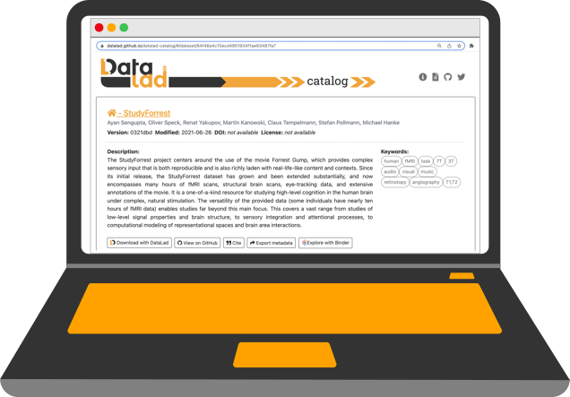

## --- UNDER DEVELOPMENT ---
*This repository is undergoing continuous development and all branches should be considered unstable*

---

# DataLad Catalog - Create a user-friendly data browser from structured metadata

[](http://docs.datalad.org/projects/catalog/en/latest/?badge=latest)



This extension to DataLad allows you to generate a standalone browser-based user interface for [Datalad](https://www.datalad.org/) datasets by:
1. parsing Datalad-derived metadata,
2. translating the metadata into structured data understandable and renderable by the frontend
3. generating a VueJS-based frontend with which to interactively browse the dataset's metadata.


## 1. Online demo

Navigate to [https://datalad.github.io/datalad-catalog/](https://datalad.github.io/datalad-catalog/) to view a live demo of the current work-in-progress state of the user interface.

This demo site is hosted via GitHub Pages and it builds from the `gh-pages` branch of this repository.

## 2. How it works

DataLad's metadata capabilities (see [datalad-metalad](https://github.com/datalad/datalad-metalad)) allows extracting metadata from DataLad datasets, subdatasets, and files, and to aggregate this information to the top-level dataset. When exported (using e.g. `datalad meta-dump`, `meta-extract`, or `meta-conduct`), these metadata objects can be ingested and parsed by `datalad catalog`. This package translates the DataLad metadata into structured data required by the VueJS-based user interface, and it also generates the assets for the interface (artwork, CSS, JavaScript and HTML). The resulting content can be hosted as a standalone website (as is the case for the demo above) without requiring any building steps beforehand.

## 3. Install `datalad catalog`

### Step 1 - Setup and activate virtual environment

With your virtual environment manager of choice, create a virtual environment and ensure
you have a recent version of Python installed. Then activate the environment. E.g. with
[miniconda](https://docs.conda.io/en/latest/miniconda.html#latest-miniconda-installer-links):

```
conda create -n catalog python=3.9
conda activate catalog
```

### Step 2 - Clone the repo and install the package

Run the following from your command line:
```
git clone https://github.com/datalad/datalad-catalog.git
cd datalad-catalog
pip install -e .
```

Congratulations! You have now installed `datalad catalog`.

To generate metadata that is compatible with `datalad catalog`, you will need to install
the latest version of `datalad metalad` from GitHub (the install process above installs
it as a dependency, but it installs an earlier release from PyPi). Run the following:

```
git clone https://github.com/datalad/datalad-metalad.git
cd datalad-metalad
pip install -e .
```

Lastly, in order to build a full data management pipeline from raw data to catalog, you
will need to use `datalad`, for which you need `git-annex`. This might already have been
installed as part of the process above, depending on your operating system. For complete
instructions on how to install `datalad` and `git-annex`, please refer to the
[DataLad Handbook](https://handbook.datalad.org/en/latest/intro/installation.html).


## 4. Generate a catalog locally

### Step 1 - access and clone DataLad dataset(s)
In order to generate a catalog, you will need to have access to a DataLad dataset (or many of them).Note: this would be the metadata representation of the dataset and all its files, but the actual file content (residing in the annex) will most likely not be necessary.

To get access to a DataLad dataset, use `datalad` in the command line as follows:
```
datalad clone <dataset-loaction>
```

### Step 2 - metadata extraction/aggregation
This needs to be followed by a process of metadata extraction with `datalad metalad`, using commands such as `datalad meta-dump`, `datalad meta-extract`, or `datalad meta-conduct`. Extraction and aggregation results in the aggregated dataset- and file-level metadata from which the catalog will be generated. Currently, this metadata should be an array of JSON objects in a text file.

For a detailed example of how to get from raw DataLad datasets to input data for `datalad catalog`, please refer to [this sample pipeline description](datalad_catalog/examples/sample_catalog_pipeline.md).

For an example of such an input file, have a look at [`datalad_catalog/examples/sample_input_metadata.json`](datalad_catalog/examples/sample_input_metadata.json).

### Step 3 - generate the catalog

`datalad catalog` can be used via the command line with specific commands:

```bash
# Create a catalog at loctaion <path/to/catalog/directory>, using input data located at <path/to/input/data>
datalad catalog create -c <path/to/catalog/directory> -m <path/to/input/data>
# Add metadata to an existing catalog at loctaion <path/to/catalog/directory>, using input data located at <path/to/input/data>
datalad catalog add -c <path/to/catalog/directory> -m <path/to/input/data>
# Set the superdataset of an existing catalog at loctaion <path/to/catalog/directory>, where the superdataset id and version are provided as arguments
datalad catalog set-super -c <path/to/catalog/directory> -i <dataset_id> -v <dataset_version>
```

### Step 4 - render the catalog

#### a) Start a webserver with Python

The webserver is necessary because the code uses [XMLHttpRequest](https://developer.mozilla.org/en-US/docs/Web/API/XMLHttpRequest) to `GET` data from local file, and you will run into CORS errors (e.g. [here](https://stackoverflow.com/questions/10752055/cross-origin-requests-are-only-supported-for-http-error-when-loading-a-local)) when trying to access content on the local file system without a web server.

Within your virtual environment, navigate to your catalog directory and then start the webserver:

```
python3 -m http.server
```

#### b) Open the locally hosted user interface

The step above opens a server at [http://localhost:8000/](http://localhost:8000/), which you can navigate to in your browser. This will render the `index.html` page in your browser, which is the same (or very similar) content that is served to the demo page.

For developers, this local server will allow you to view your changes in real-time as you develop. After making changes to `index.html`, `assets/vue_app.js` or `assets/style.css` (for example), you can refresh your browser tab to view changes.


## 5. Contributing

### Feedback / comments

Please [create a new issue](https://github.com/jsheunis/data-browser-from-metadata/issues/new) if you have any feedback, comments, or requests.

### Developer requirements

If you'd like to contribute as a developer, you need to install a number of extra dependencies:

```
cd datalad-catalog
pip install -r requirements-devel.txt
```

This installs `sphinx` and related packages for documentation building, `coverage` for code coverage testing, and `pytest` for testing.

### Contribution process

To make a contribution to the code or documentation, please:

- create an issue describing the bug/feature
- fork the project repository,
- create a branch from `main`,
- check that tests succeed: from the project root directory, run `pytest`
- commit your changes,
- push to your fork
- create a pull request with a clear description of the changes